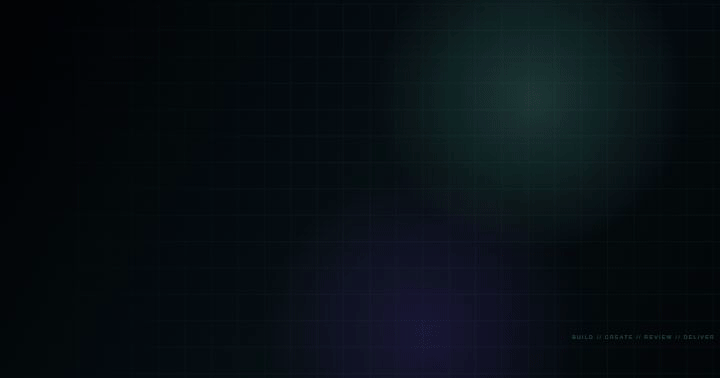
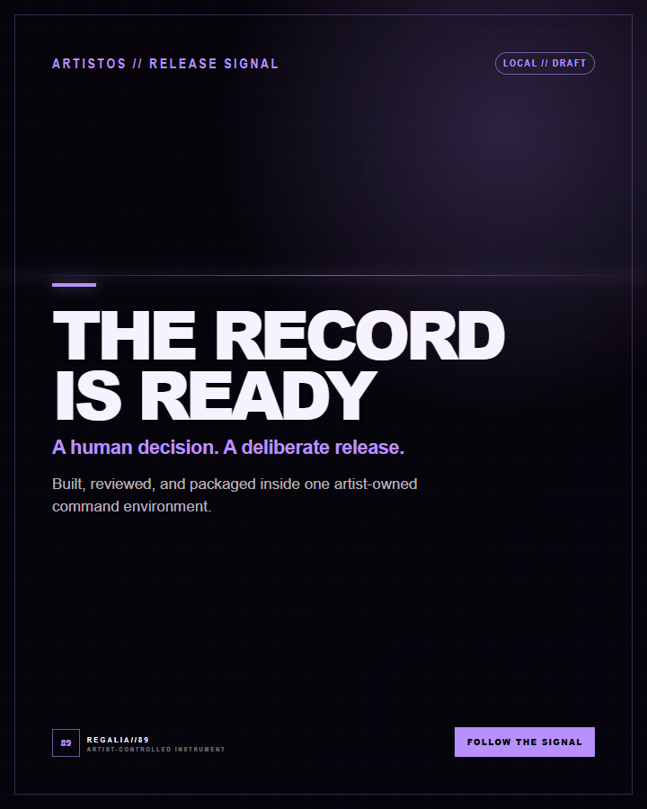
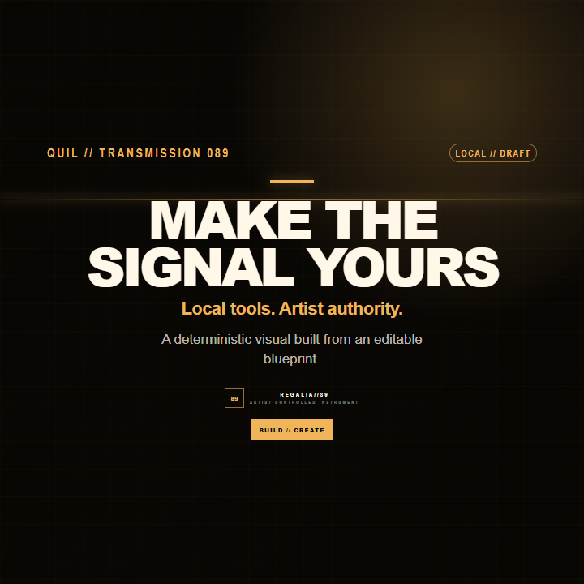
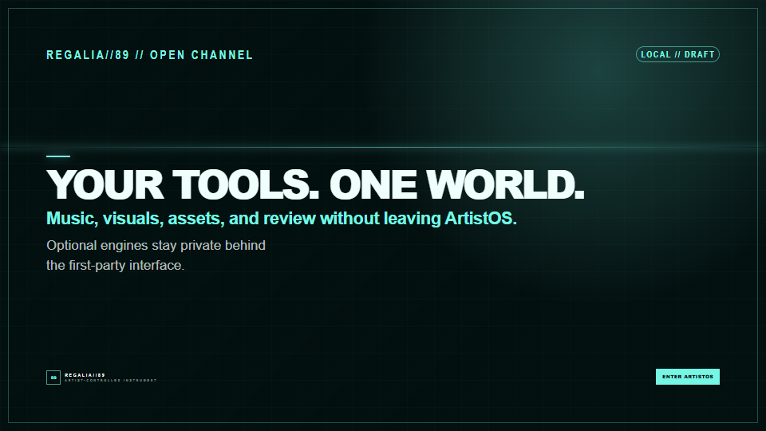

<div align="center">

# ArtistOS

### Create without leaving your world.

One artist-owned command environment for music, visuals, assets, review, and deliberate delivery.

[](https://nodejs.org/)
[](LICENSE)
[](ARTISTOS.md)



</div>

ArtistOS wraps creative engines in the first-party **REGALIA//89 interface**.
Music Maker, Visual Maker, and Asset Forge expose controls, progress, results,
and receipts inside ArtistOS; native engine GUIs are never embedded or linked.

| Local by default | Artist decides | Engines stay optional |
|---|---|---|
| Node.js, a browser, and a writable workspace are enough for the core. | Draft, review, approval, and publication remain distinct actions. | Add Remotion, ACE-Step, live data, or delivery adapters only when needed. |

## The creative studio

| Music Maker | Visual Maker | Asset Forge |
|---|---|---|
| Shape prompts, sources, tempo, generation, candidates, and receipts through ArtistOS. | Direct format, hierarchy, copy, color, media, and render progress without opening an engine UI. | Save reusable visual blueprints and music sessions; rendering and generation require separate confirmation. |

## Made with the included engine

Every image below is a deterministic render from the public
[`QuilAssetForgeVisual`](tools/artistos-remotion/src/compositions/quil-asset-forge/index.tsx)
composition—no private artist media and no generated-model imagery.

<table>
  <tr>
    <td width="33%"></td>
    <td width="33%"></td>
    <td width="33%"></td>
  </tr>
  <tr>
    <td align="center"><strong>Event poster</strong><br><sub>Portrait system</sub></td>
    <td align="center"><strong>Cover card</strong><br><sub>Square system</sub></td>
    <td align="center"><strong>Announcement</strong><br><sub>Landscape system</sub></td>
  </tr>
</table>

The source props live in [`tools/artistos-remotion/examples/`](tools/artistos-remotion/examples/).
Rebuild the complete README media set:

```bash
cd tools/artistos-remotion
npm ci
npm run render:readme
```

## Quick start

Requirements: Node.js 20+ and a current browser. The Command Center core has no
runtime package dependencies.

```bash
cd tools/command-center
npm run doctor
npm test
npm start
```

Open `http://127.0.0.1:8989`.

To operate on a separate writable artist workspace:

```bash
ARTISTOS_WORKSPACE_ROOT=/path/to/artist-workspace npm start
```

The app starts safely with an empty workspace and creates operational state only
after the first intentional save.

## System boundary

```text
Browser
  └─ REGALIA//89 first-party UI
       └─ ArtistOS loopback server
            ├─ local state + review + approvals
            ├─ Asset Forge → fixed Remotion worker (optional)
            ├─ Music Maker → authenticated ACE-Step REST adapter (optional)
            ├─ QUIL LIVE / WaveWarz observations (optional)
            └─ manual delivery by default
```

No arbitrary browser commands. No ambient-credential activation. Saving is not
rendering; rendering is not approval; approval is not publication.

## Website mode

ArtistOS supports passcode-gated use behind an HTTPS reverse proxy. Read
[`tools/command-center/WEBSITE-DEPLOYMENT.md`](tools/command-center/WEBSITE-DEPLOYMENT.md).

ArtistOS is a stateful Node service, not a static Netlify site. Netlify may front
a separately hosted origin, but the server and writable workspace need a
persistent host.

## Repository boundary

This public repository contains reusable source, tests, schemas, examples, and
documentation. It excludes OxQuan's private media, masters, campaigns, feedback,
analytics, credentials, operational state, model weights, caches, and generated
artist outputs.

The code is MIT licensed. ArtistOS, REGALIA//89, OxQuan, WearHaus, WAVIEZ, QUIL,
WavID, and related marks remain covered by the separate
[`TRADEMARKS.md`](TRADEMARKS.md) boundary.

## Contributing and security

- [`CONTRIBUTING.md`](CONTRIBUTING.md)
- [`SECURITY.md`](SECURITY.md)
- [`CODE_OF_CONDUCT.md`](CODE_OF_CONDUCT.md)
- [`ARTISTOS.md`](ARTISTOS.md)
